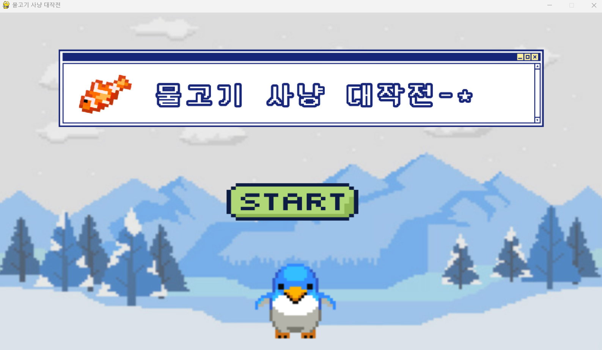

# pygame-fish-hunting-adventure
물고기 사냥 대작전



## Story
_펭귄이 바다표범을 피해 물고기 모아서 우주로 떠나기 위한 대작전_ <br>
펭귄은 빙하에서 사는 게 심심해서 이제 우주로 떠나려 합니다. 그런데 우주선은 너무 비싸요. <br>
물고기를 모아 펭귄을 도와주세요!


## Get Started
```pip install pygame```
```python main.py```


## Screen
### Information
* 장르 : 레이싱
* 형태 : 가로형
* 스테이지 : 0단계

### Character
#### player : 펭귄


#### score : 물고기


#### key : 점프, 더블점프


## Team
| [Daeyeol Sung](https://github.com/Daeye0l) |[Yuna kim](kkiwiio)|[Eunchong Kim](https://github.com/rltgjqmtkdydwk) |
|:----------------------------------------------:|:---:|:-----------------------------------------------:|
|    ||  |
|                    Frontend                     |Frontend|                    Frontend                     |

#### Contact
if you have some feedback, use github review.
