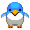

# pygame fish-hunting-adventure 🐧🎣

## 📌프로젝트 소개
본 프로젝트는 성공회대학교 오픈소스SW개발 과목의 게임 개발 프로젝트입니다. 


## 📌스토리 소개

### Title: 물고기 사냥 대작전-★
**Information**
* 장르 : 액션, 장애물 뛰어넘기
* 형태 : 가로형
* 스테이지 : 0단계

**Game Story**
> 펭귄의 꿈은 우주로 떠나는 겁니다
펭귄이 포식자들을 피해 무사히 우주로 갈 수 있도록  도와주세요!


## Get Started
```pip install pygame``` <br>
```python main.py```


## Screen
### Information

### Character
#### player : 펭귄


#### stumbling block : 바다표범, 갈매기
<p align="left">


</p>

#### score : 물고기


#### key : 점프, 더블점프
<p align="left">


</p>

## Team
| [Daeyeol Sung](https://github.com/Daeye0l) |[Yuna kim](kkiwiio)|[Eunchong Kim](https://github.com/rltgjqmtkdydwk) |
|:----------------------------------------------:|:---:|:-----------------------------------------------:|
|    ||  |
|                    Frontend                     |Frontend|                    Frontend                     |

#### Contact
if you have some feedback, use github review.