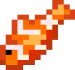

# pygame-fish-hunting-adventure 🐧🎣
물고기 사냥 대작전


## Story
**펭귄이 바다표범을 피해 물고기 모아서 우주로 떠나기 위한 대작전** <br>
펭귄은 빙하에서 사는 게 심심해서 이제 우주로 떠나려 합니다. 그런데 우주선은 너무 비싸요. <br>
물고기를 모아 펭귄을 도와주세요!


## Get Started
> recommend environment <br>
[](https://www.python.org) [](http://pygame.org)

### 1. Install python<br/>
pygame을 설치하기 위해선 python이 필요합니다. 먼저 컴퓨터에 python이 설치되어 있는지 확인하세요.
```sh
python --version
```
Python 3.17.16" 라는 메세지가 나오면 Python이 올바르게 설치된 것입니다. 오류 메시지가 뜨면 공식 문서를 참고하십시오.

### 2. Install pip<br/>
pygame을 설치하려면 pip이 필요합니다.
pip이 설치되어 있는지 확인하세요.
```sh
pip --version
```
"pip 20.0.2 from /usr/lib/python3/dist-packages/pip (python 3.8)"와 같은 메시지가 나타나면 pygame을 설치할 준비가 된 것입니다!

### 3. Install pygame
다음 명령어로 pygame을 설치하세요.
```sh
pip install pygame
```
terminal에서 위 명령어로 pygame을 설치하세요.

### 4. Run game
```sh
python main.py
```
실행했을 때 다음과 같이 뜨면 게임이 실행됩니다.
```sh
[Running] python -u "/Usr/username/dir/pygame-fish-hunting-adventure/main.py"
pygame 2.5.2 (SDL 2.28.3, Python 3.11.4)
Hello from the pygame community. https://www.pygame.org/contribute.html
2023-10-23 17:27:33.542 python[41546:6087355] TSM AdjustCapsLockLEDForKeyTransitionHandling - _ISSetPhysicalKeyboardCapsLockLED Inhibit

[Done] exited with code=0 in 5.093 seconds
```


## Screen
### Information
* 장르 : 액션, 장애물 뛰어넘기
* 형태 : 가로형
* 스테이지 : 0단계

### Character
#### player : 펭귄


#### stumbling block : 바다표범, 갈매기
<p align="left">


</p>

#### score : 물고기


#### key : 점프, 더블점프
<p align="left">


</p>

## Team
| [Daeyeol Sung](https://github.com/Daeye0l) |[Yuna kim](kkiwiio)|[Eunchong Kim](https://github.com/rltgjqmtkdydwk) |
|:----------------------------------------------:|:---:|:-----------------------------------------------:|
|    ||  |
|                    Frontend                     |Frontend|                    Frontend                     |

#### Contact
if you have some feedback, use github review.